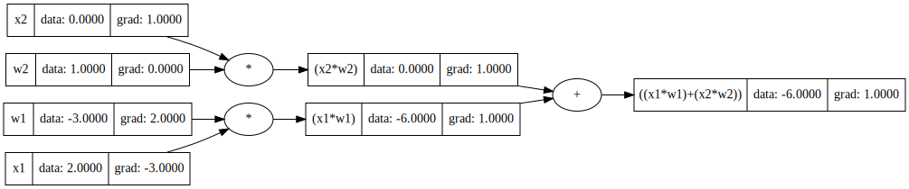

# MicroGrad

  

MicroGrad gives you a simple clear implementation of the autograd graph, the core engine for gradients
calculation enabling neural networks to perform back propagation, the core training techniques of these
magical nets.  
  
MicroGrad is a tiny implementation of the autograd graphs, in just a 100 lines of code, it calculates the gradients of each node using the chain rule of calculus, with the implementation of several different mathematical operations.  

On top of that, you will find here a complete simple implementation of a Neural Network class, build using the MicroGrad engines, enabling you to build and train real simple Neural Networks.  

## Examples
### An Autograd Graph

```python
# inputs x1,x2
x1 = Value(2.0, label='x1')
x2 = Value(0.0, label='x2')

# weights w1,w2
w1 = Value(-3.0, label='w1')
w2 = Value(1.0, label='w2')

# x1*w1 + x2*w2
x1w1 = x1*w1
x2w2 = x2*w2
o = x1w1 + x2w2

# gradients calculation
o.backward()
draw_graph(o)
```



### Neural Network

```python
x = [
    [2.0, 3.0, -1.0],
    [3.0, -1.0, 0.5],
    [0.5, 1.0, 1.0],
    [1.0, 1.0, -1.0],
]

ys = [1.0, -1.0, -1.0, 1.0]


model = NeuralNetwork(3, [4, 4, 1])

# Training
params = model.parameters()

for i in range(100):
    # forward pass
    y_pred = [model(v) for v in x]

    # loss calculation
    loss = sum(((y_predicted - y_real)**2 for y_real, y_predicted in zip(ys, y_pred)))

    # gradients calculation
    model.zero_grad()
    loss.backward()

    # weights updata
    for p in params:
        p.data += -0.05 * p.grad
    
    if i%10 == 0:
        print(i, loss.data)
```